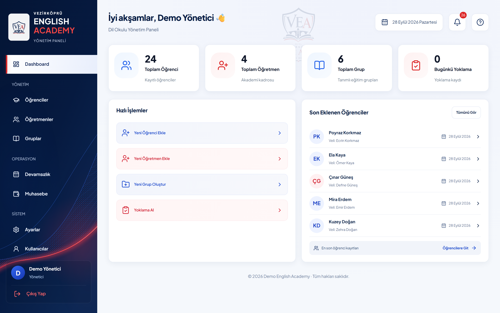
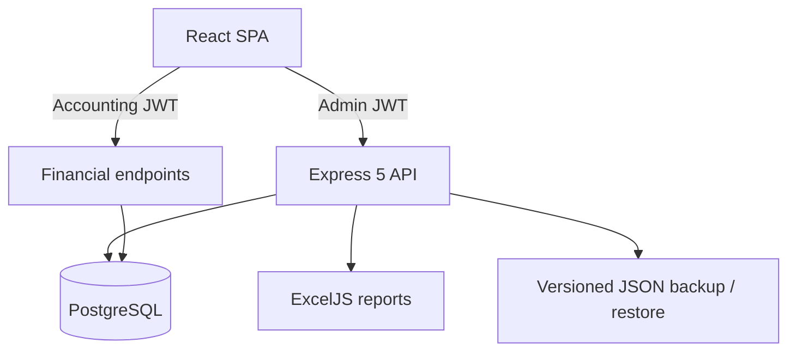
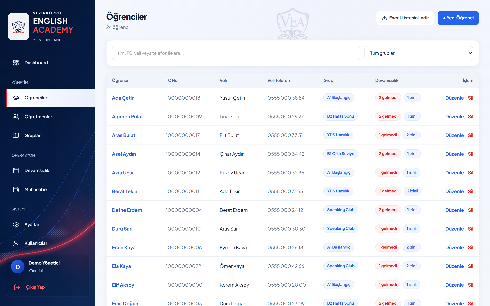
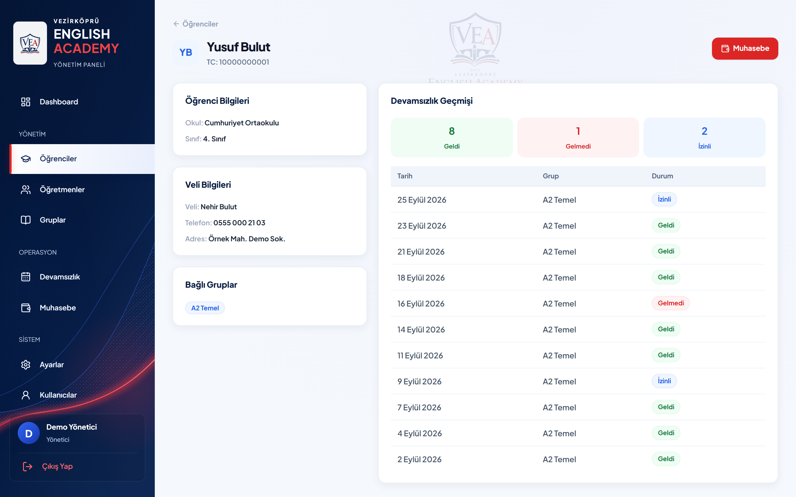
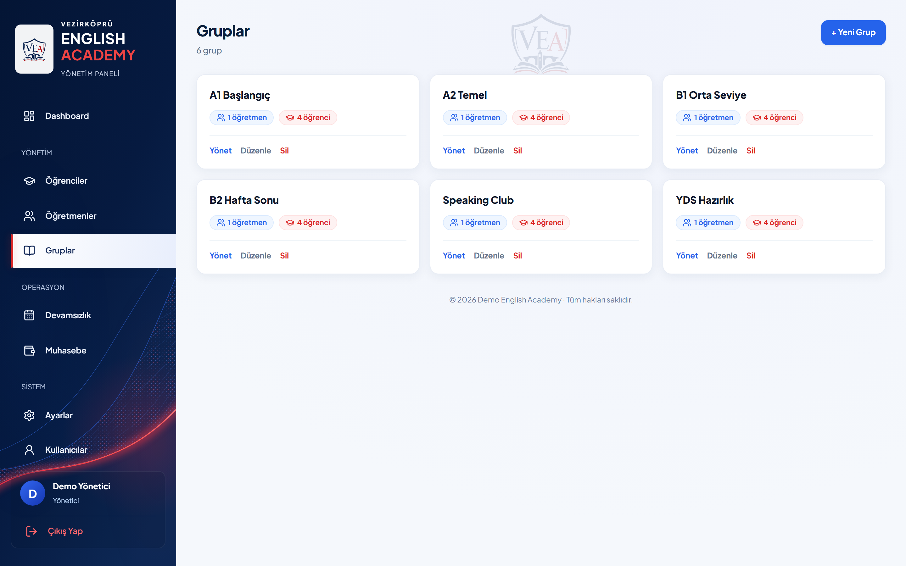
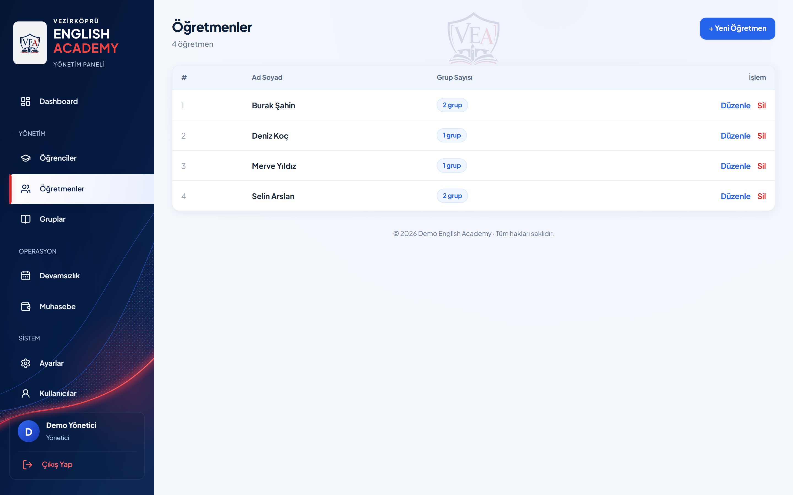
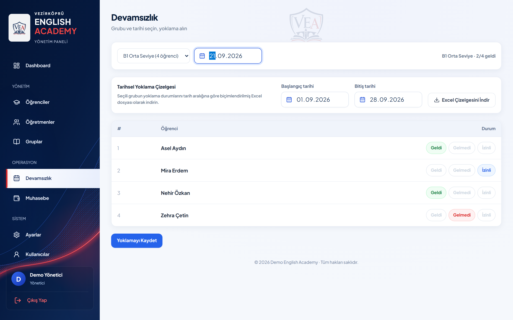
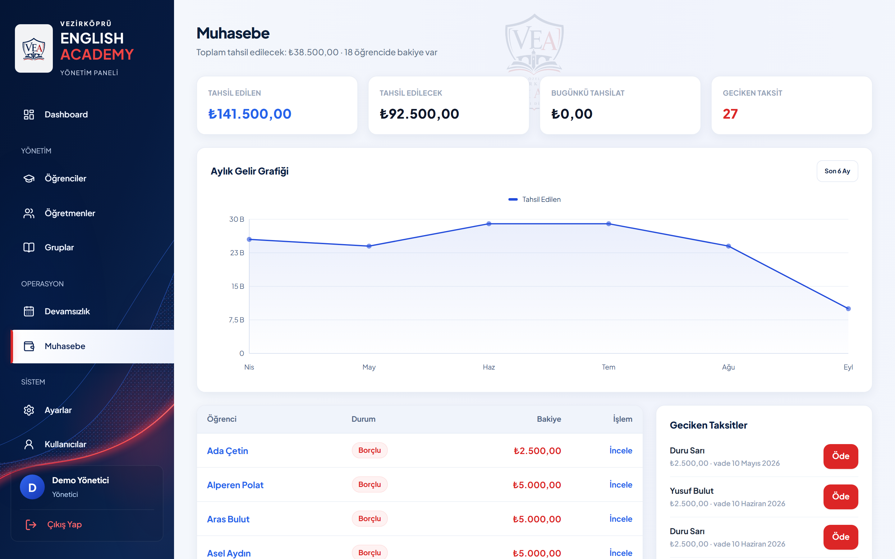
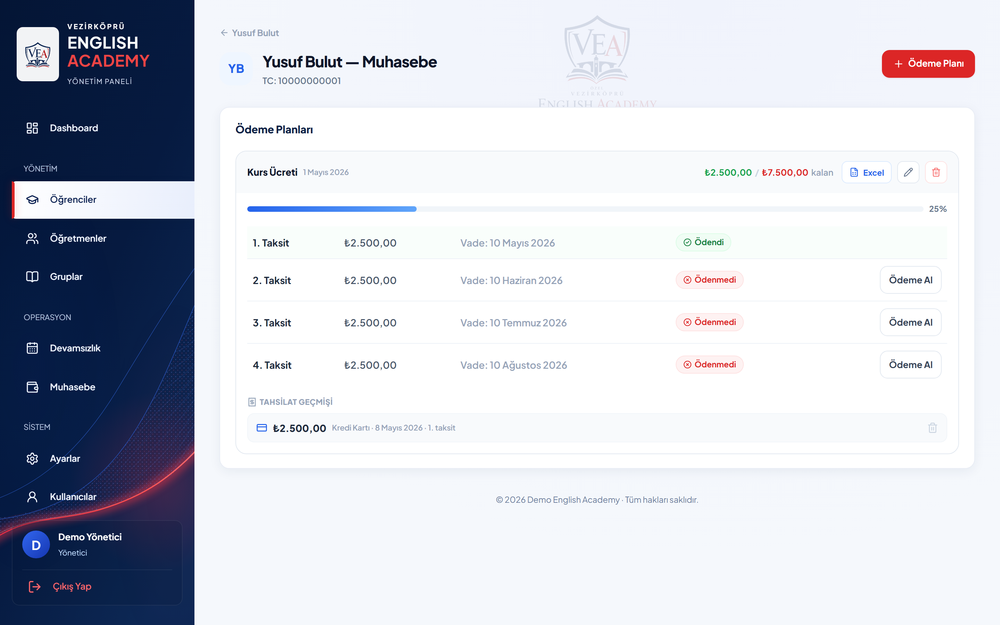
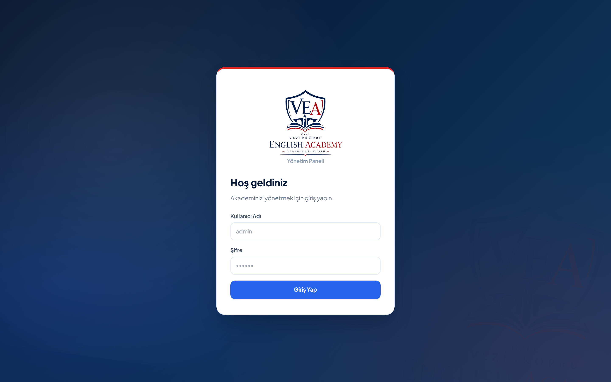

# English Academy — Operations Platform

> Production-tested management software for language schools, tutoring centres and course providers.

This is a **documentation-only showcase**. The production source code is private because the system is used by a real language school. A guided code walkthrough is available on request.

| Status | Scope | Stack |
| --- | --- | --- |
| In production | Students, classes, attendance, tuition and reporting | React, Express 5, PostgreSQL, Railway |

## The problem

Small education teams often operate through separate spreadsheets for enrolment, attendance and tuition. That makes routine work repetitive, weakens visibility into overdue payments and spreads critical operational knowledge across files.

The goal was not to build another generic dashboard. It was to replace those disconnected workflows with one reliable operational system.

## My role

I designed and built the product end to end: requirements, interface, Express API, PostgreSQL model, financial rules, Excel reporting, security controls, backup/restore and Railway deployment.

## What the system does

- **Students, teachers and class groups:** full CRUD, many-to-many group assignment, search, filters and a styled XLSX student export.
- **Attendance:** per-group, per-day roll call with present, absent and excused states; official-style XLSX sheets for date ranges of up to one year.
- **Tuition:** up-front and installment plans, partial payments, overdue tracking, monthly revenue visibility and per-plan Excel export.
- **Notifications:** new enrolments, expiring teacher contracts and overdue installments, including read/unread state.
- **Recovery:** portable versioned JSON backups with SHA-256 integrity checks and transactional restore.

## Architecture

The API and compiled SPA run as a single Railway service. Database migrations are idempotent and multi-table financial or restore operations run inside transactions.

## Decisions that matter

### Financial truth comes from payment records

Balances are not stored as mutable totals. They are calculated from payment records at read time, preventing stale or contradictory financial state.

### Finance has a second security boundary

Accounting pages require a separate password gate and short-lived token in addition to the main admin session. The gate has its own inactivity timeout.

### Recovery works on hosted PostgreSQL

The browser-driven backup format does not depend on `pg_dump`, Docker or filesystem access. Restore requires explicit confirmation and the administrator password, verifies integrity and completes inside one transaction.

## Product proof

- Built around real enrolment, attendance and tuition workflows.
- Running in production for a real language school.
- Handles partial payments and overdue installments instead of presenting accounting as a static demo.
- Includes operational safeguards such as inactivity expiry, restore rollback and integrity verification.

No invented efficiency or revenue figures are claimed here. A future version of this case study should add anonymised before/after measurements from the institution.

## Productisation path

The production system is currently single-tenant. A sellable version for multiple institutions would add:

1. Organisation-level tenant isolation.
2. Granular roles for owners, accounting staff and teachers.
3. Institution branding and configurable academic/payment rules.
4. Parent/student portals, messaging and automated reminders.
5. Subscription, onboarding, audit history and support tooling.

## Screenshots

All records shown below are fictional demo data. Names, identity details and phone numbers do not belong to real people.

| Students | Student detail |
| --- | --- |
|  |  |

| Groups | Teachers |
| --- | --- |
|  |  |

| Attendance | Accounting |
| --- | --- |
|  |  |

| Student payment plan | Login |
| --- | --- |
|  |  |

## Technology

| Layer | Technology |
| --- | --- |
| Frontend | React 18, Vite, React Router, Tailwind CSS |
| Backend | Node.js, Express 5, JWT authentication, rate limiting |
| Database | PostgreSQL, raw parameterised SQL, idempotent migrations |
| Reporting | ExcelJS server-side XLSX generation |
| Deployment | Railway, one process serving the API and built SPA |

## Privacy and ownership

The screenshots and documentation are shared for portfolio review only. The production code and real operational data are not included. See [LICENSE.md](LICENSE.md).

© Mert Olgun. All rights reserved.
